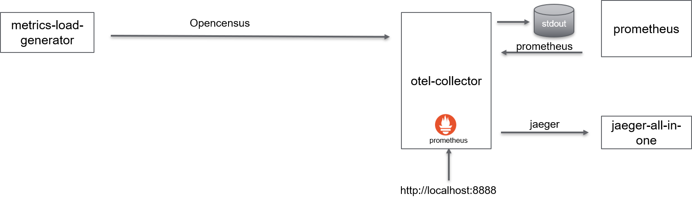

# Overview
Capture metrics using Opentelemtry collector from a metric load generator in opencensus format

The program is a end loop doing:
- Start Span
- Compute random sleep value up to 17 ms
- Sleep
- Stop Pan
- Create value containing elapsed time since beg of loop => **latency**
- Record from 0 to 6 values (from 0 to 999) => **LineLength**
- Record Latency value

The following metrics are monitored:
- Latency: Record distribution of latency (number of  latency value within a range over the time)
Record number of time latency has been recorded
Record sum of latency
- LineLength: Record distribution of latency (number of  latency value within a range over the time)
Record number of time LineLength has been recorded
Record sum of LineLength

Original code: from [Github](https://github.com/open-telemetry/opentelemetry-collector/tree/master/examples
)

# Build
make build

# Run with docker-compose
make start

# Visualize
## Traces
Traces can be seen with Jaeger: http://localhost:16686
## Metrics
Metrics can be seen in text mode: http://localhost:8888/metrics
Metrics can be seen with prometheus: http://localhost:9090

# Stop
make down
