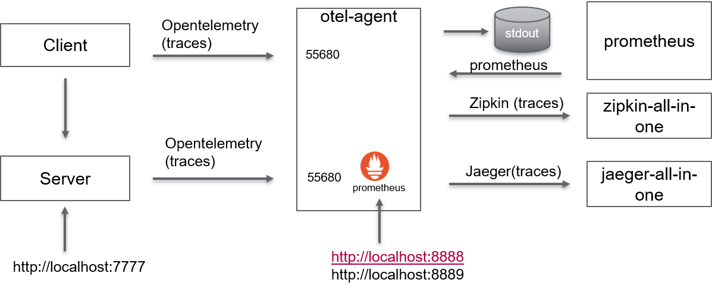

# Overview

An HTTP client connects to an HTTP server. They both generate span information to `stdout`.
These instructions expect you have [docker-compose](https://docs.docker.com/compose/) installed.
Create relationship between spans
Demonstrate trace context propagation inside and across processes

Original code: from [Github](https://github.com/open-telemetry/opentelemetry-go/sample/http)

The example has disappear from the latest release


# Build
make build

## Run with docker-compose
make start

## Generate trace
Optionally generate trace on server: curl http://localhost:7777/hello

## Visualize
### Traces
Traces can be seen with Jaeger: http://localhost:16686
Traces can be seen with Zipkin: http://localhost:9411/zipkin

### Metrics
Metrics can be seen in text mode: http://localhost:8888/metrics
Metrics can be seen with prometheus: http://localhost:9090

## Stop
make down

```
