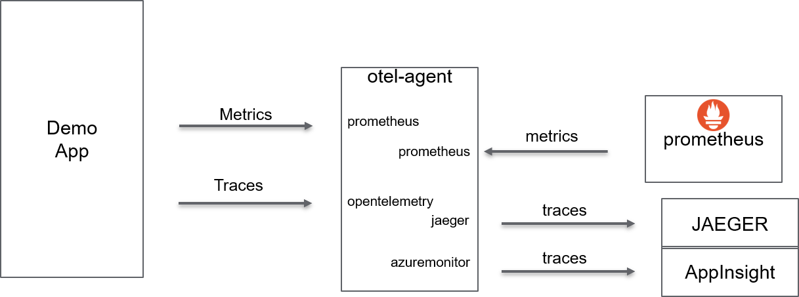
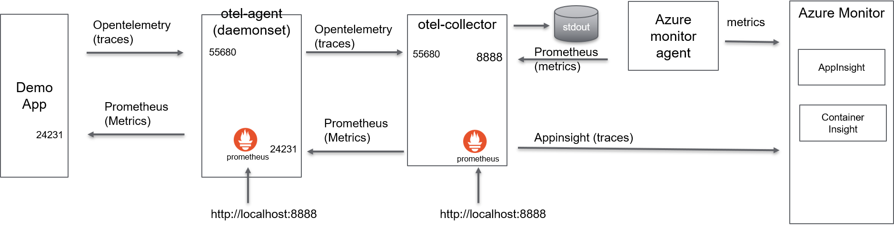

# Overview
Play around with Opentelemetry SDK for python (traces and metrics)
Run example with collector using
- dokcer-compose
- on K8S and send traces and metrics to Appinsight

# docker-compose
## Overview


## Build
make build

## Run 
make start APP_INSIGHT_INSTRUMENTATION_KEY="<my secret>"

## Generate traces
curl http://localhost:5000

## Visualize
### Traces
Traces can be seen with Jaeger: http://localhost:16686
### Metrics
Metrics can be seen in text mode: http://localhost:5000/metrics
Metrics can be seen with prometheus: http://localhost:9090

## Stop
make down


# Kubernetes
## Overview

## Create demoapp container
make build
make push

## Configure Azure monitor agent
```
# Configure Azure monitor agent to scrap prometheus data from containers with propoer annotation
kubectl apply -f container-azm-ms-agentconfig.yaml
```
## Deploy Opentelemetry collector and daemonset agent for traces and metrics

kubectl create namespace otel
make deploy_otel APP_INSIGHT_INSTRUMENTATION_KEY="<my secret>"

## Deploy demoapp to AKS kluster
az account list
az account set --subscription US0110167-DMnP-Dev-Int
az aks get-credentials --resource-group cdm-na01-k-rg-cdmdev --name cdm-na01-k-aks-cdmdev
kubectl create namespace demoapp
make deploy_app DOCKER_IMAGE_TAG=latest

## Generate traces and metrics from the demoapp
kubectl exec -it -n demoapp $(kubectl get pods -A | grep demoapp | awk '{print $2}') -- curl -k http://localhost:5000

## Visualize traces and metric in azure monitor
### Metrics and log
https://portal.azure.com/#@seaad.onmicrosoft.com/resource/subscriptions/9e7dbf8b-6a81-4beb-9434-8113e1c7a0a4/resourceGroups/cdm-na01-k-rg-cdmdev/providers/Microsoft.ContainerService/managedClusters/cdm-na01-k-aks-cdmdev/logs
```
InsightsMetrics
| where Namespace contains "prometheus"
```
### Trace
Inside Appinsight

## Debug
kubectl run curl --image=radial/busyboxplus:curl -i --tty
kubectl exec -it curl -- nslookup otel-collector.otel
kubectl exec -it -n demoapp $(kubectl get pods -A | grep demoapp | awk '{print $2}') -- nslokkup otel-collector.otel

kubectl exec -it -n otel $(kubectl get pods -A | grep otel-coll | awk '{print $2}') -- curl -k http://localhost:8888/metrics
kubectl exec -it curl -- curl -k http://otel-collector.otel:24231/metrics
kubectl exec -it curl -- curl -k http://otel-collector.otel:24231/metrics

## Delete container from AKS kluster
kubectl delete -f deployment.yaml -n demoapp
kubectl delete -f otel_deployment.yaml -n otel
kubectl delete -f container-azm-ms-agentconfig.yaml


